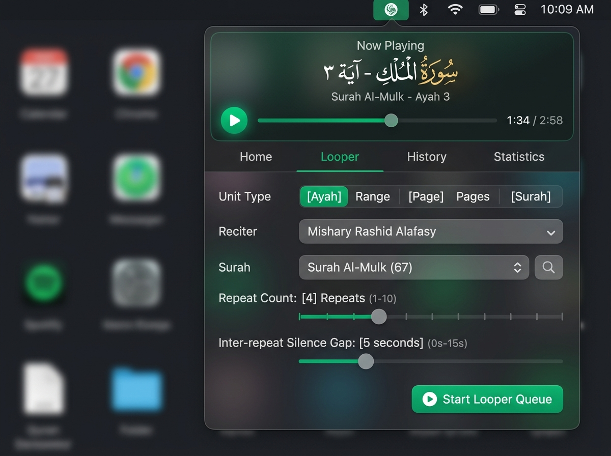
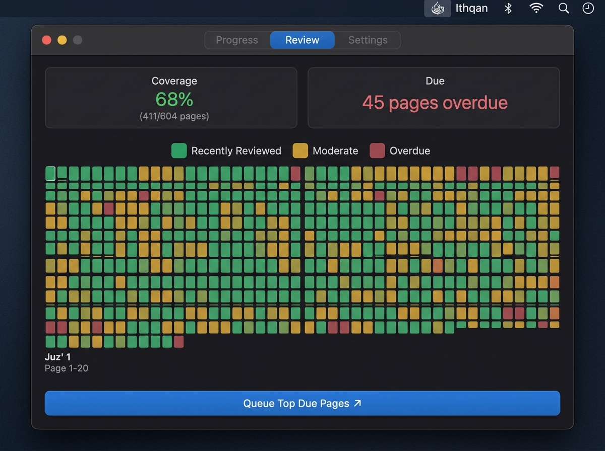
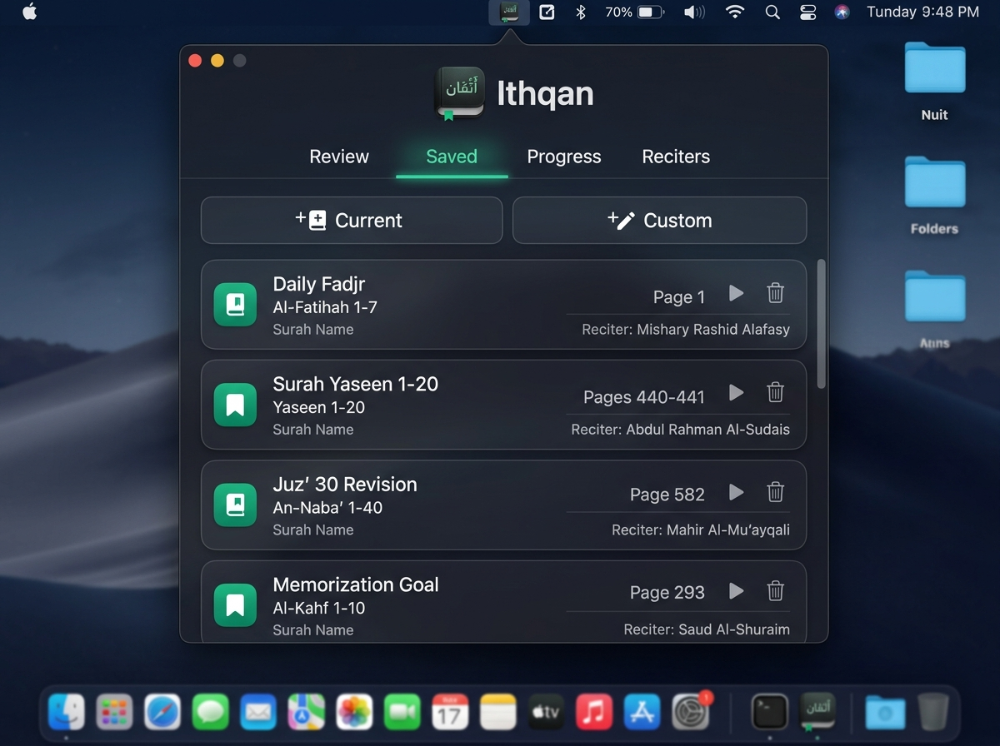
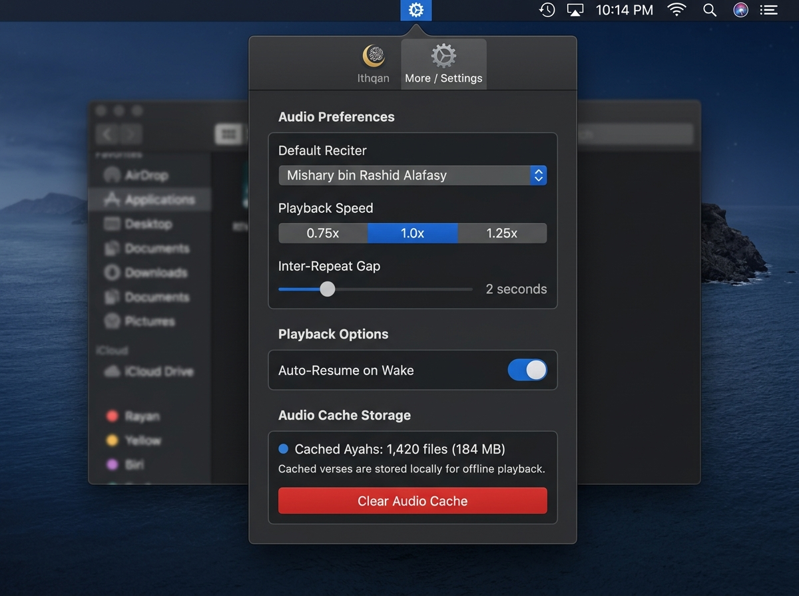
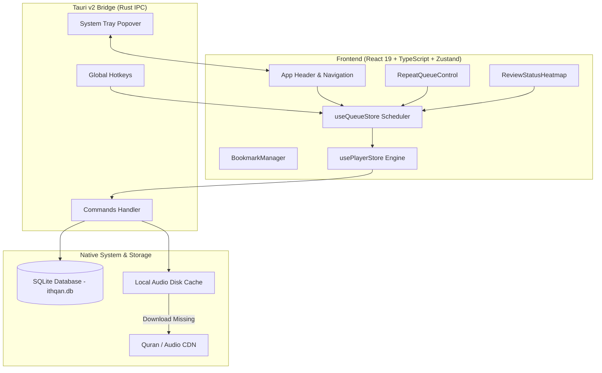

# Ithqan (إتقان) — Desktop Quran Review Companion

> A high-performance, local-first macOS and desktop menu bar application built for Huffaz and students of the Quran to structure memorization, track retention across all 604 pages, and customize audio repetition workflows.


---

## 📌 Problem Solved

Memorizing and retaining the Quran (*Hifz* and *Muraja'ah*) requires continuous, disciplined repetition and systematic review over 604 pages (30 Juz'). Students and Huffaz frequently run into major operational obstacles with standard audio players and paper logs:

1. **Lack of Versatile Repetition Controls**: Standard media players only loop entire audio tracks. They lack granular verse-by-verse repetition, configurable silence gaps between repeats (allowing the student to recite back from memory), and multi-level repetition modes (e.g., repeat each Ayah 3x, then repeat the whole page 2x).
2. **Forgetting Curve & Decay Tracking**: Without visual feedback, it is difficult to keep track of which pages were reviewed recently versus which pages are decaying (>10 days unreviewed). Manual paper trackers are cumbersome to maintain.
3. **Desktop Friction & Distraction**: Opening full browser windows or bloated desktop applications disrupts workflow. Huffaz need a lightweight, floating menu bar app accessible instantly via hotkey without switching contexts.
4. **Network Dependence & Interruption**: Audio streaming buffering breaks recitation flow. Local caching and instant offline playback are mandatory for continuous study sessions.

**Ithqan (إتقان)** solves these challenges by combining a **native menu bar popover interface**, an **advanced audio looper engine**, an **interactive 604-page spaced-repetition heatmap**, and a **local SQLite storage & audio caching system**.

---

## 🛠️ Tools & Technology Stack

| Layer | Technology | Purpose & Capabilities |
| :--- | :--- | :--- |
| **Desktop Shell** | **Tauri v2 (Rust)** | Provides native macOS menu bar system tray integration, borderless popover window management, global hotkeys, and system wake listeners. |
| **Backend & Persistence** | **Rust + SQLite (`rusqlite`)** | Local-first relational storage for review history, page logs, user settings, bookmarks, and local audio file cache metadata. |
| **Frontend Framework** | **React 19 + TypeScript** | Component-driven UI rendering with strict type safety for queue management and player configurations. |
| **State Management** | **Zustand v5** | Reactive state management powering `useQueueStore` (queue progression) and `usePlayerStore` (HTML5 audio engine integration). |
| **Styling & Design** | **Tailwind CSS v4** | Modern dark glassmorphism design system customized for macOS popovers (`var(--bg-popover)`, custom scrollbars, segmented controls). |
| **Audio Engine** | **HTML5 Audio + REST APIs** | Seamless gapless playback, speed adjustment (0.75x–1.25x), inter-repeat silence gaps, and automated pre-caching from EveryAyah / Quran API. |
| **Icons & Typography** | **Lucide React + Arabic Fonts** | Minimalist UI iconography combined with native Arabic typography for clean Quranic readability. |

---

## 💡 Key Architectural Approaches

- **Spaced-Repetition Decay Heatmap**: Automatically categorizes all 604 pages into three decay tiers based on `last_reviewed_at` timestamps:
  - 🟢 **Fresh**: Reviewed within 3 days.
  - 🟡 **Moderate**: Reviewed within 4–10 days.
  - 🔴 **Overdue**: Unreviewed for over 10 days or never reviewed.
- **Smart Queue Prioritization**: The "Queue Top Due Pages" algorithm evaluates page review history and automatically queues the 10 most critical overdue pages into the repetition looper.
- **Multi-Level Looping Modes**:
  - `per_ayah`: Repeats each individual Ayah $N$ times before advancing.
  - `per_page`: Plays all Ayahs on a page, then repeats the whole page $N$ times.
  - `per_page_chunk`: Splits a page into sub-chunks for step-by-step memorization.
  - `per_block`: Loops an entire selected Ayah/Page range as a single continuous block.
- **Auto-Resume on System Wake**: Automatically syncs with OS sleep/wake and window focus events to resume paused audio queues instantly upon opening the popover.
- **Offline Audio Caching Engine**: Downloads audio files locally to `$APPDATA` so review sessions work completely offline with zero latency.

---

## 🖥️ Page Explanations & Walkthrough

### 1. 🎧 Audio Looper & Repetition Engine (`Looper` Tab)

The **Looper** view is the primary operational dashboard for customizing review sessions.



**Key Features & Workflow**:
- **Unit Selection**: Choose between single `Ayah`, `Range`, single `Page`, `Pages` range, or full `Surah`.
- **Reciter Selection**: Select from top reciters (e.g., Mishary Rashid Alafasy, Abdul Basit, Husary, Minshawi).
- **Repeat Parameters**:
  - **Repeat Count**: Set repetition per unit from 1x to 10x.
  - **Inter-Repeat Silence Gap**: Introduce 0 to 15 seconds of silence between repeats for self-recitation.
  - **Playback Speed**: Adjust speed (0.75x, 1.0x, 1.25x) for speed-building or careful listening.
- **Now Playing Banner**: Always visible during active playback, showing Surah name, Ayah number, Arabic text script, progress slider, and pause/resume controls.

---

### 2. 📊 Review & Retention Heatmap (`Review` Tab)

The **Review** view gives an intuitive, GitHub-style visual overview of your memorization strength across the entire Quran.



**Key Features & Workflow**:
- **604-Page Visual Grid**: Every page of the Quran is rendered as an interactive tile color-coded by retention health.
- **Retention Statistics**: Real-time cards display overall **Coverage Percentage** (e.g., `68% - 411/604 pages covered`) and **Overdue Page Count**.
- **Interactive Inspection**: Hovering or clicking a tile displays exact review count and elapsed days since the last review session.
- **⚡ Queue Top Due Pages Button**: Single-click action that algorithmically selects overdue pages and instantly loads them into the Looper queue for immediate review.

---

### 3. 🔖 Bookmark & Session Manager (`Saved` Tab)

The **Saved** view allows Huffaz to bookmark specific revision targets, problematic pages, or daily review milestones.



**Key Features & Workflow**:
- **+ Current Bookmark**: Single click saves the active playing Ayah, Page, and Reciter setting.
- **+ Custom Bookmark**: Add named bookmarks with custom Surah, Ayah, and Page numbers (e.g., *"Daily Fajr Muraja'ah"*, *"Surah Yaseen 1-20"*).
- **Instant Launch**: Clicking the play icon on any saved card automatically configures the queue and starts recitation immediately.

---

### 4. ⚙️ Settings & Offline Audio Cache (`More / Settings` Tab)

The **Settings** view manages user defaults, native application behaviors, and local audio storage.



**Key Features & Workflow**:
- **Global Defaults**: Persist default Reciter, Playback Speed, and Inter-repeat silence gaps into SQLite.
- **Playback Options**: Toggle **Auto-Resume on Wake** for continuous audio flow upon opening your laptop.
- **Audio Cache Storage**: Monitor cached audio size (`1,420 files - 184 MB`) and purge offline files with a single click.

---

## 🏗️ System Architecture & Data Flow



---

## 🚀 Getting Started

### Prerequisites

Ensure you have the following tools installed on your development machine:
- **Node.js**: `v18.0.0` or higher
- **npm**: `v9.0.0` or higher
- **Rust**: Latest stable release (`rustc` & `cargo`)
- **Tauri CLI Prerequisites**: Follow the [Tauri Setup Guide](https://v2.tauri.app/start/prerequisites/) for macOS / Linux / Windows.

### Installation

1. **Clone the Repository**:
   ```bash
   git clone https://github.com/your-username/ithqan.git
   cd Ithqan
   ```

   **Install via Homebrew:**
   ```bash
   brew tap aieradev/ithqan
   brew install --cask ithqan
   ```

2. **Install Dependencies**:
   ```bash
   npm install
   ```

3. **Run in Development Mode**:
   ```bash
   npm run tauri dev
   ```
   *This starts Vite on `http://localhost:1420` and launches the native Tauri desktop popover.*

4. **Build for Production**:
   ```bash
   npm run tauri build
   ```
   *The compiled native binary (`.dmg` / `.app` on macOS) will be generated under `src-tauri/target/release/bundle/`.*

---

## ⌨️ Keyboard Shortcuts & System Tray Controls

| Shortcut / Control | Action |
| :--- | :--- |
| **System Tray Icon Click** | Toggle Ithqan popover visibility from macOS menu bar |
| **Spacebar** | Play / Pause active queue |
| **Esc** | Hide popover window |
| **Focus / System Wake** | Auto-resume playback (if enabled in settings) |

---

## 📄 License

Distributed under the MIT License. See `LICENSE` for more details.

Developed with ❤️ for the global *Huffaz* community.
